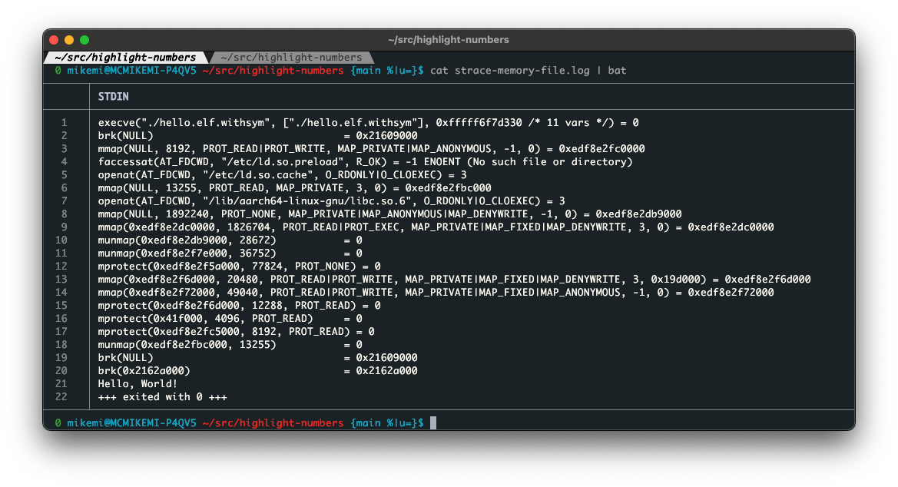
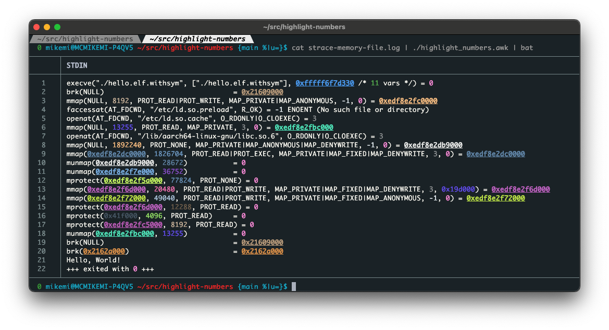

# `highlight_numbers` 🎨🔢

A lightweight `awk`, `perl`, and `python3` script for colorizing numbers in any text stream — especially useful for inspecting `strace`, logs, memory addresses, file descriptors, or any output with numeric data.

This script highlights every numeric value (both hexadecimal and decimal), assigning each a **deterministic, bright, unique RGB foreground color**.  

Large hexadecimal numbers (e.g., 64-bit memory addresses) are also **bold and underlined** to make them stand out further.

Supports:
- ✅ 24-bit ANSI color output
- ✅ Deterministic per-number coloring
- ✅ Foreground colors only (no background noise)
- ✅ Bold + underline for large hex values
- ✅ Fast, line-safe processing (no duplication, no corruption)
- ✅ Fully compatible with [`mawk`](https://invisible-island.net/mawk/) and `gawk` (for use in minimal Ubuntu docker image)
- ✅ Fully compatible with `perl` and `python3` with no additional packages required


---

## ✨ Example

```bash
strace -e trace=memory,file ./hello-world 2>&1 | highlight_numbers.awk
```

**Before:**



**After:**



## 📦 Installation


Just clone the repo and make the script executable:

```bash
git clone https://github.com/mikeage/highlight-numbers
cd highlight-numbers
chmod +x highlight_numbers.*
```

Optional: copy to a system-wide location:

```bash
sudo cp highlight_numbers.* /usr/local/bin/
```

## 🧠 How it works

* Uses a DJB2 hash for each number
* Maps the hash to an RGB triplet
* Ensures minimum brightness so no colors are dark or invisible
* Big hex numbers are bold+underlined for visibility
* Built-in tweaks to distinguish small decimal values (like 0, 1, 3)

## ✅ Compatibility

POSIX-compliant

Works with:
* mawk
* gawk
* python3
* perl

No dependencies on any packages

## 🔒 Limitations

* ANSI color codes are supported in most modern terminals (e.g. xterm, iTerm2, gnome-terminal, wezterm). If you're on an older terminal, 24-bit color may not display correctly.
* Does not handle multiline numbers (e.g., wrapped across lines)
* Doesn't parse structure (e.g., JSON nesting), just colors numbers in stream

## 📝 License

MIT License.

Enjoy, and feel free to fork or improve!

## 👤 Author

Created by Mike Miller, gpt-4o, and claude-3.7-sonnet.

Inspired by tools like colout, strace-analyzer, and too much staring at monochrome logs.
